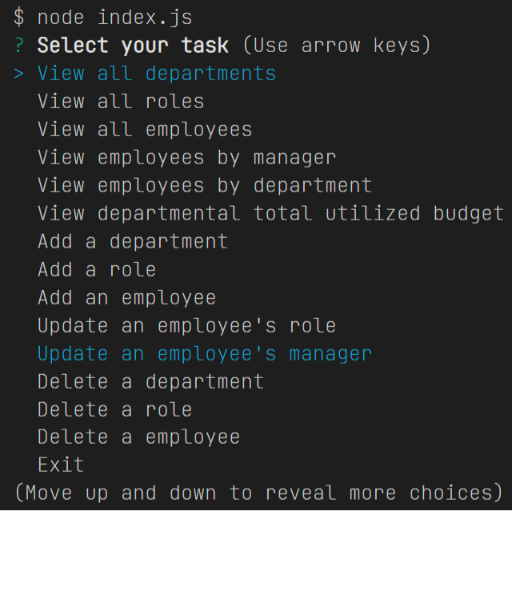
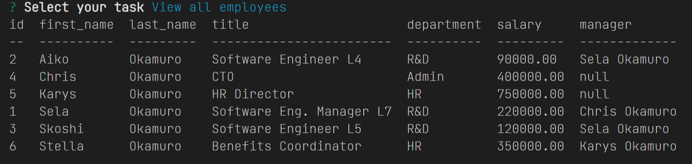
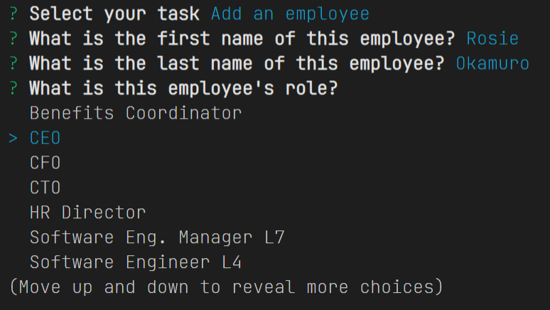

# 12 SQL Challenge: SQL Employee Tracker

[Video of program walkthrough](https://drive.google.com/file/d/1G5JpB9bWvJKUOm6al68ppfCt6-XWDpR_/view)

## Table of Contents
- [Description](#description)
- [Visuals](#visuals)
- [Usage](#usage)

## Description
This is the solution JavaScript and SQL script for the 02-Challenge assignment in the 12 SQL Module.

The purpose of the assignment was to create a Node.js program that operates with a console-based text menu, triggering a number of query, creation, update, and deletion tasks within a mysql database.  Data entry is handled with *Inquirer (v8.2.4)*, and database access is handled with *mysql2*.

The project requirements consisted of:
1. queries for all departments, all roles, amd all employees
2. functionality to add departments, roles, and employees
3. updating an employee role

For the additional *20 points of extra credit*, this project also implements:
1. additional queries for employees by manager, employees by department, and total utilized budget by department
2. the ability to update (or deselect) the manager of an employee
3. the ability to delete departments, roles, and employees

This project achieves all of the stated criteria, while also providing selectable lists for all prompts where referential IDs are the underlying data (ex. you can pick a manager from a scrolling list, rather than having to know their row id).

## Usage 
This program has has dependencies, and requires their installation via *npm*.  This program can be invoked via Node at the command prompt using *node index.js*.

## Installation Instructions
The program requires *npm* installation of the mysql, console.table, and inquirer modules (and their dependencies).  Mysql needs to be installed on the machine, with the server set up to accept login from user *root* with a *blank password*.  If that is not compatible with your configuration, you can change lines 9 and 10 in *index.js* to reflect the actual authentication credentials.  The SQL script *./db/schema.sql* needs to be run in Mysql prior to starting the SQL Employee Tracker.  Optional seed data is also provided in *./db/seed.sql*.

## Visuals
### The program in operation
[Video of program walkthrough](https://drive.google.com/file/d/1G5JpB9bWvJKUOm6al68ppfCt6-XWDpR_/view)

